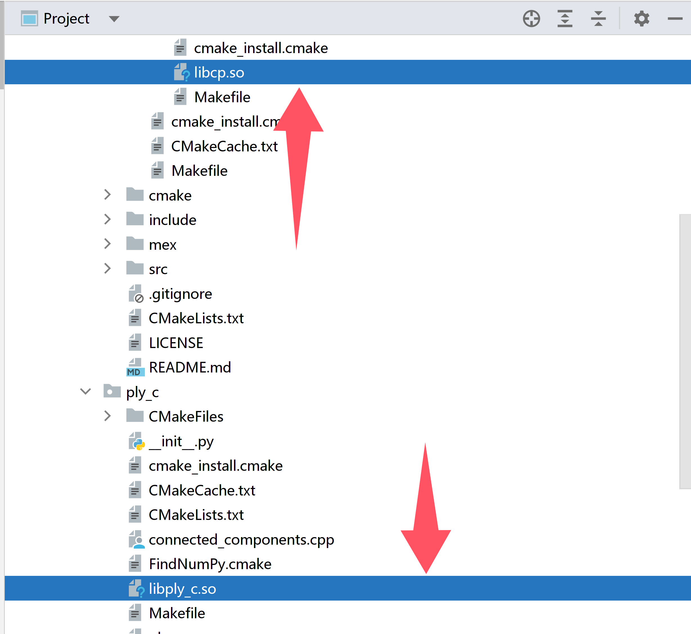

# Install Process

- Create a virtual environment

  ```
  conda create -n torch2.1.0 python=3.10
  ```

- Check the CUDA version (recommended: 11.8).

  ```
  nvcc -V
  ```

- Install Torch 2.1.0

  ```
  conda install pytorch==2.1.0 torchvision==0.16.0 torchaudio==2.1.0 pytorch-cuda=11.8 -c pytorch -c nvidia
  ```

- Install `libply_c` for the geometry-aware partitioning strategy.

  ```
  conda install -c anaconda boost
  conda install -c omnia eigen3
  conda install eigen
  conda install -c r libiconv
  cd lib/Partition_lib/ply_c
  CONDAENV=/home/lab/anaconda3
  cmake . -DPYTHON_LIBRARY=$CONDAENV/lib/libpython3.10.so -DPYTHON_INCLUDE_DIR=$CONDAENV/include/python3.10 -DBOOST_INCLUDEDIR=$CONDAENV/include -DEIGEN3_INCLUDE_DIR=$CONDAENV/include/eigen3
  make
  ```

  >1. Replace `CONDAENV` with your own environment path.
  >
  >2. Replace `libpython3.10.so` with the corresponding version file from your own environment.
  >3. Replace `python3.10` with the corresponding version used in your own environment.

- Install libcp for the geometry-aware partitioning strategy.

  ```
  cd lib/Partition_lib/cut-pursuit
  mkdir build
  cd build
  cmake .. -DPYTHON_LIBRARY=$CONDAENV/lib/libpython3.10.so -DPYTHON_INCLUDE_DIR=$CONDAENV/include/python3.10 -DBOOST_INCLUDEDIR=$CONDAENV/include -DEIGEN3_INCLUDE_DIR=$CONDAENV/include/eigen3
  make
  ```

  >1. Replace `libpython3.10.so` with the corresponding version file from your own environment.
  >
  >2. Replace `python3.10` with the corresponding version used in your own environment.

  **Note**

  After compilation, if it succeeds, two `.so` files will be generated. Be sure to check for them.

  

- Install other packages

  ```
  pip install tensorboard
  pip install tensorboardx
  conda install https://anaconda.org/pytorch3d/pytorch3d/0.7.7/download/linux-64/pytorch3d-0.7.7-py310_cu118_pyt210.tar.bz2
  pip install easydict==1.13
  pip install thop==0.1.1.post2209072238
  pip install ninja==1.11.1.3
  pip install h5py==3.13.0
  pip install matplotlib==3.5.0
  pip install numpy==1.24.0
  pip install open3d==0.19.0
  pip install pyYAML==6.0.2
  pip install scipy==1.15.2
  pip install timm==1.0.15 --no-deps
  pip install tqdm==4.67.1
  pip install trimesh==4.6.4
  pip install scikit-image==0.25.2
  pip install torch_scatter==2.1.2+pt21cu118(https://pytorch-geometric.com/whl/这里下载安装)
  ```

- Install cuML for accelerating SVM evaluation

  ```
  pip install --extra-index-url=https://pypi.nvidia.com "cuml-cu11==25.2.*"
  ```

  >webside of cuml
  >
  >https://rapids.ai/

