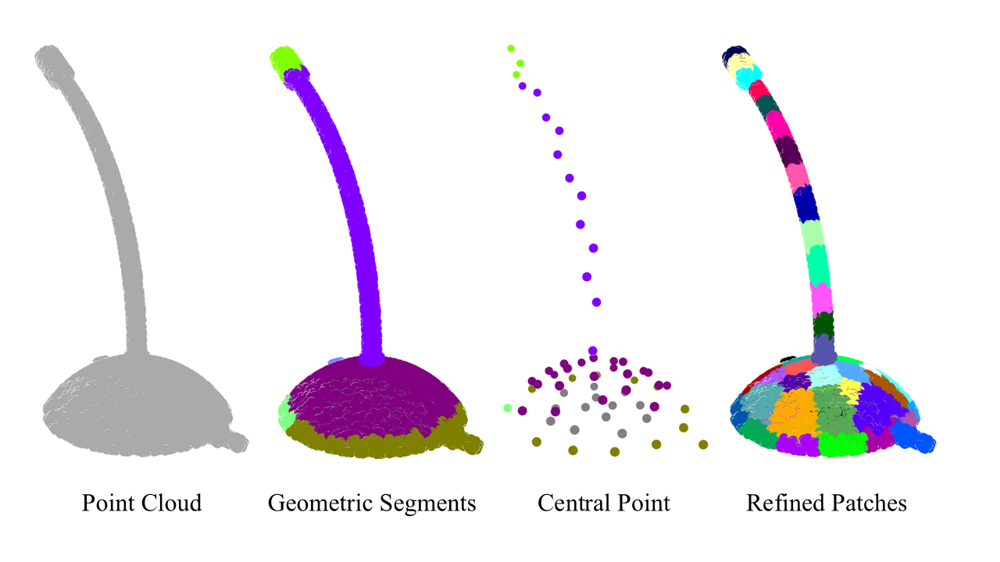
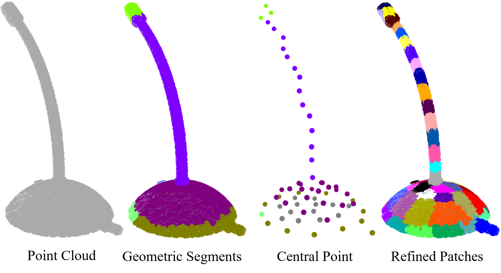
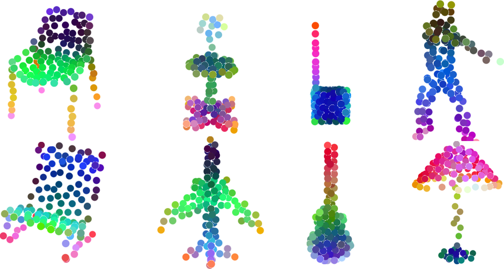

# 🔷**[PointGAC](https://arxiv.org/abs/2507.04801)**

Official PyTorch implementation of **PointGAC: Geometric-Aware Codebook for Masked Point Cloud Modeling**

***Accepted at ICCV 2025* 🎉**

## 📣News

- **[2025-07-03]** The code is released! Now you can train your customized models! 🚀  
- **[2025-06-26]** Our paper has been accepted by **ICCV 2025**! 🏆

## 🌐**Overview**

**PointGAC** is a novel approach for masked point cloud modeling, which learns meaningful features through a clustering-based strategy. Unlike conventional regression-based MPM methods, PointGAC aligns the feature distributions of masked regions by leveraging an online-learned, geometry-aware codebook within a teacher-student framework.


## 🧩**TODO List**

- [x] Provide code for geometry-aware partitioning strategy
- [x] Provide code for pretraining
- [x] Provide code for finetune on for ModelNet40, ScanObjectNN, ShapeNetPart
- [x] Provide inference scripts for ModelNet40
- [x] Provide visualization code for inspecting model outputs
- [ ] Extend to larger-scale datasets  
- [ ] Provide code for fine-tuning on point cloud completion

## ⚙️**Installation**

- **Requirements:** 

  Python=3.10,  PyTorch=2.1.0, TorchVision=0.16.0, CUDA=11.8, PyTorch3D=0.7.7.

- **Installation Steps**: 

  For detailed instructions on setting up the environment, please refer to the [install.md](Install.md) file.

## 📁**Datasets**

- We have provided some data under the `data` directory for certain datasets to facilitate debugging.

- **ModelNet40**

  1. Download the [ModelNet40](https://modelnet.cs.princeton.edu/) dataset from its official website.

  2. Convert mesh to point cloud

     ```
     cd datasets/dataset_prepare
     python PreparePointsFPS.py --in_dir ModelNet40_off --out_dir ModelNet40_npy --ext off --n-points 1024 --n-process 16
     ```

  3. Perform Geometric Segmentation

     ```
     python PreparePointPartition.py --src_file <your_file_path> --src_dir <your_data_dir> --n_process 16
     ```

- **ShapeNet**

  1. Download the [ShapeNetCore V2](https://shapenet.org/download/shapenetcore) dataset.

  2. Prepare point cloud data.

     ```
     cd datasets/dataset_prepare
     python PreparePointsFPS.py --in_dir ShapeNet_off --out_dir ShapeNet_npy --ext obj --n-points 8192 --n-process 16
     ```

  3. Perform Geometric Segmentation

     ```
     python PreparePointPartition.py --src_file <your_file_path> --src_dir <your_data_dir> --n_process 16
     ```

- **Other datasets**

  Keep the same procedure as above datasets.

  1. Download the dataset.
  2. Perform sampling on the point cloud.
  3. Apply geometric partitioning.

## 🏋️‍♀️**Pretraining**

- Pretrain on ShapeNet:

  ```
  python main.py --config cfgs/pretrain_config/pretrain_pointgac.yaml --exp_name pretrain
  ```

- Evaluate pretrained model on ModelNet40:

  ```
  python main_vis.py --config cfgs/pretrain_config/pretrain_pointgac.yaml --exp_name test
  ```

- Resume training:

  ```
  python main.py --config cfgs/pretrain_config/pretrain_pointgac.yaml --exp_name pretrain --resume
  ```

## 🔧**Fine-tuning**

- Classification on ModelNet40

  ```
  python main.py --config cfgs/finetune_config/finetune_modelnet.yaml --exp_name finetune_modelnet --finetune_model_cls
  ```

- Classification on ScanObjectNN (Object Only) 

  ```
  python main.py --config cfgs/finetune_config/finetune_scan_obj_only.yaml --exp_name finetune_scan_obj_only --finetune_model_cls
  ```

- Classification on ScanObjectNN (with Background)

  ```
  python main.py --config cfgs/finetune_config/finetune_scan_obj_bg.yaml --exp_name finetune_scan_obj_bg --finetune_model_cls
  ```

- Classification on ScanObjectNN (Hardest Split)

  ```
  python main.py --config cfgs/finetune_config/finetune_scan_obj_hardest.yaml --exp_name finetune_scan_obj_hardest --finetune_model_cls
  ```

- Few-shot Learning on ModelNet:

  ```
  python main.py --config cfgs/finetune_config/finetune_fewshot.yaml --exp_name finetune_modelnet_fewshot --finetune_model_cls --way <5 or 10> --shot <10 or 20> --fold <0-9>
  ```

- Part Segmentation on ShapeNetPart:

  ```
  python main.py --config cfgs/finetune_config/finetune_partseg.yaml --exp_name finetune_partseg --finetune_model_seg
  ```

## 🧪Demo 1

- We have provide a demo of Geometry-aware Patch Partitioning.

  ```
  cd demo/demo_geo_cut
  python demo.py
  ```

  

**Note:**

-  In the demo code, the following two lines appear:

  ```
  sys.path.append("/root/data-tmp/lab/exp/Submit/PointGAC/lib/Partition_lib/cut-pursuit/build/src")
  sys.path.append("/root/data-tmp/lab/exp/Submit/PointGAC/lib/Partition_lib/ply_c")
  ```

  Please remember to **change these paths** according to your environment. These paths should be the directories containing the compiled shared libraries. Please refer to the `install.md` file for installation instructions.

  - `libcp.so`
  - `libply_c.so`

  After following the instructions in `install.md` and compiling the `.cpp` files, these two `.so` files will be generated under the respective build folders, similar to the illustration below:

  ```
  lib/Partition_lib/cut-pursuit/build/src/libcp.so
  lib/Partition_lib/ply_c/libply_c.so
  ```

- If you find it a bit troublesome, please refer to the usage of Demo2.

## 🧪Demo 2

**Note:**

- If you are **unable to configure** the following shared libraries (which require an Ubuntu system for compilation):

  - `libcp.so`
  - `libply_c.so`

  and your main goal is simply to **understand how the Sinkhorn-Knopp algorithm works with masking**, then **you can directly run this demo** without setting up the partitioning libraries. 

- **This demo you can directly run on the windows system.**

- We provide a minimal demo to showcase the use of the Sinkhorn-Knopp algorithm with masking.

  ```
  cd demo/demo_sinkhorn
  python demo.py
  ```



## 🧪Demo 3

- We have also provided a demo to visualize the features learned by the model. 

- We use the `PCA` algorithm to project the learned features into the RGB space in order to illustrate semantic similarity.

  ```
  cd demo/demo_inference
  python demo.py
  ```



## 📄**Citation**

If you find this repository useful, please consider citing our work🚀

```

```


