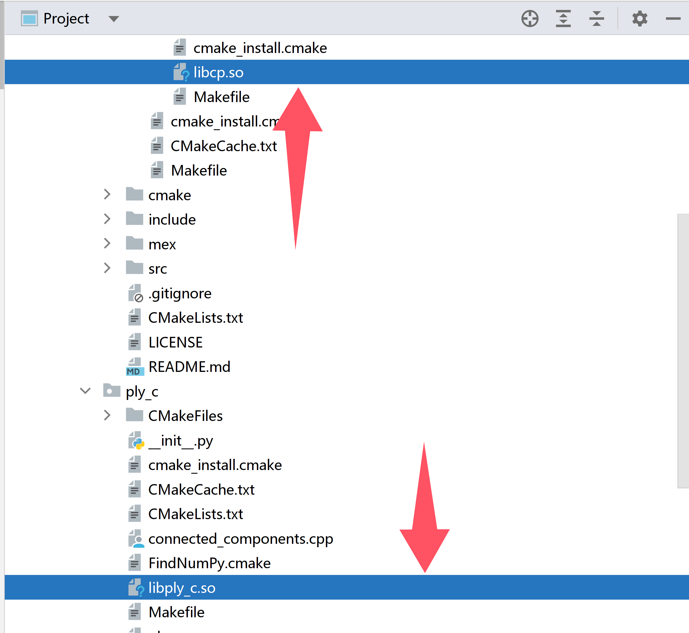

# **Note**

- **Partition_lib**: this is a package that requires compilation. The compilation process is carried out within this directory.
- If you successfully compile the package, you should also obtain these two `.so` files.
- The files are shown in the picture below.

